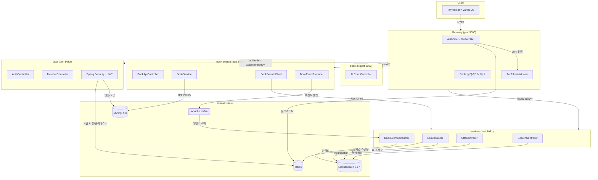
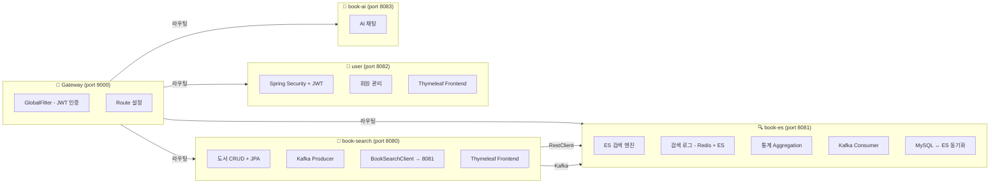
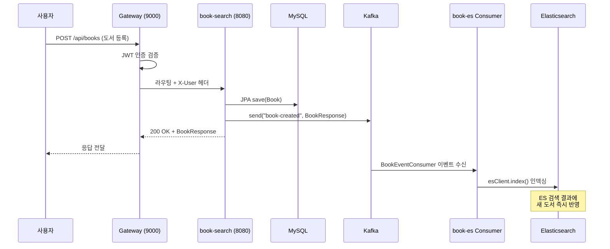
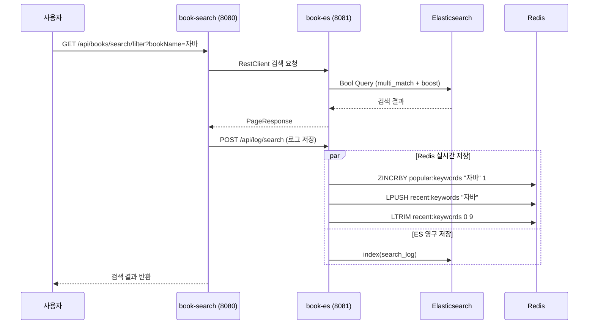
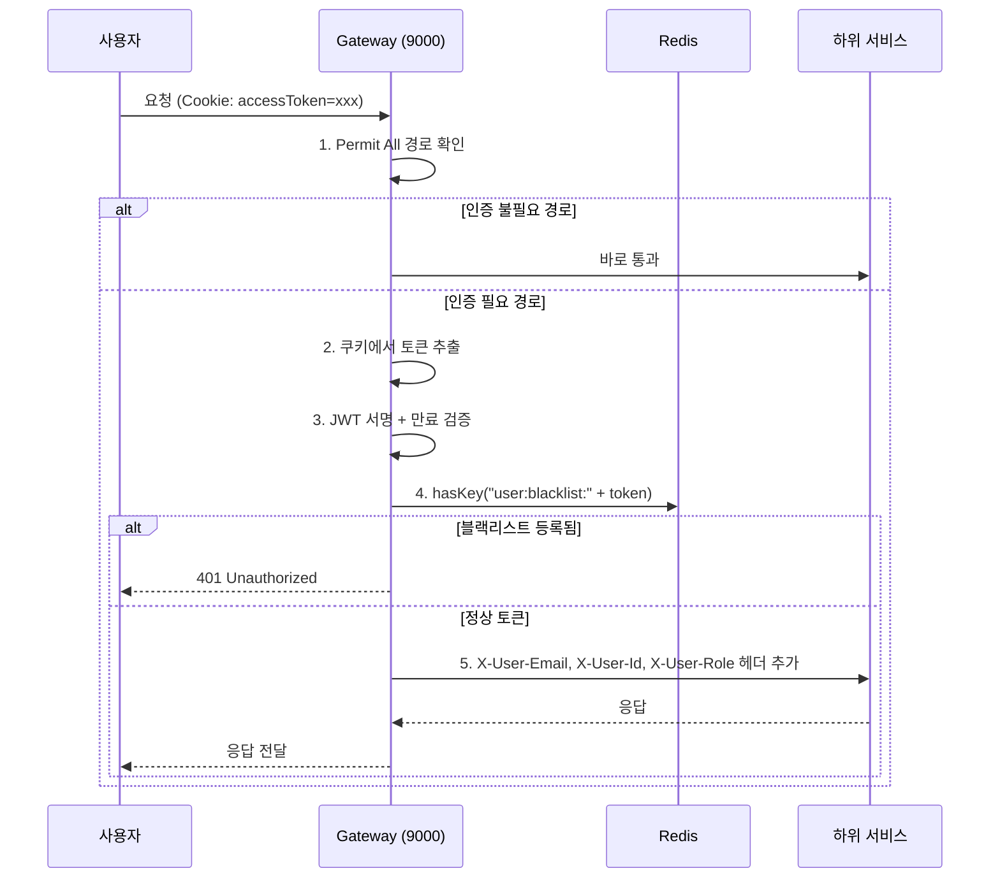
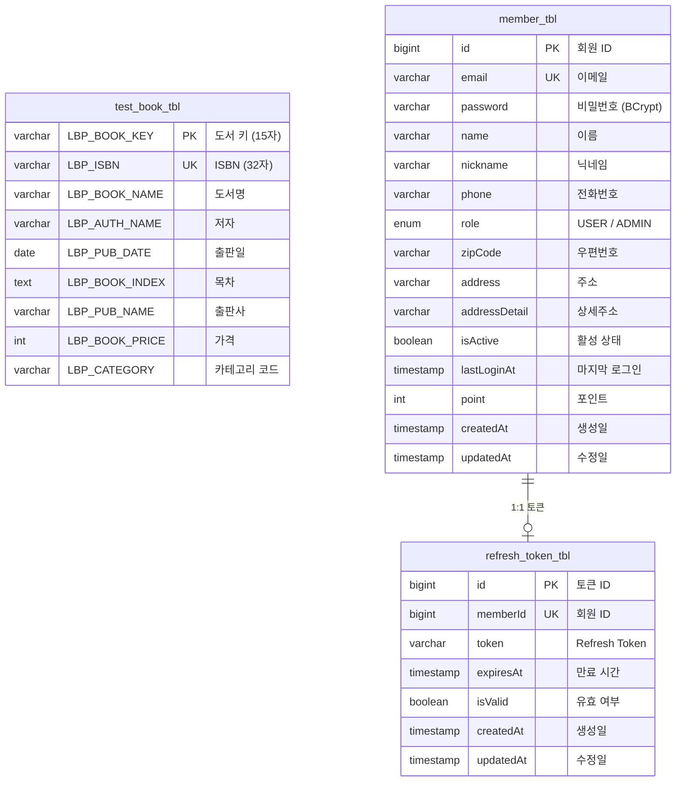
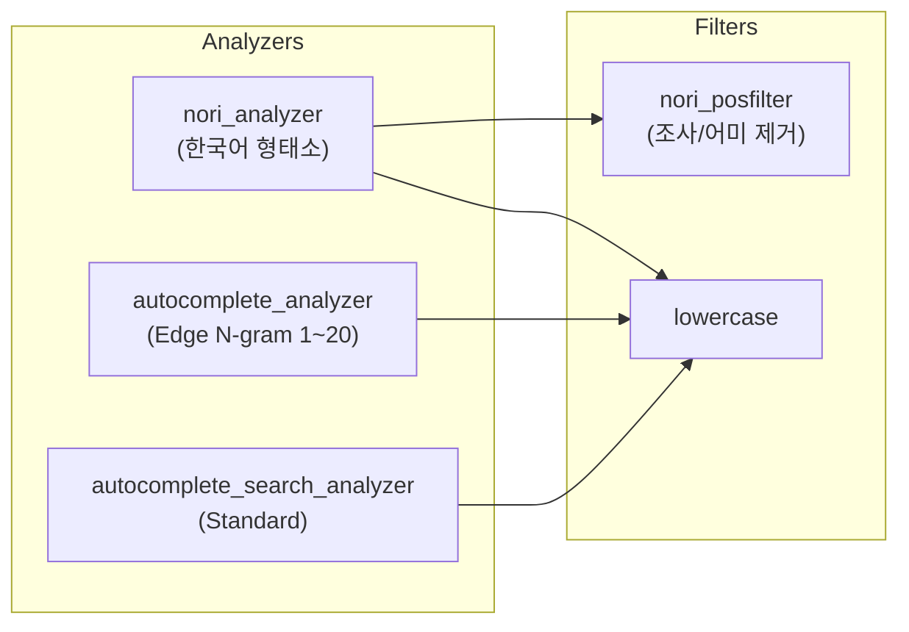
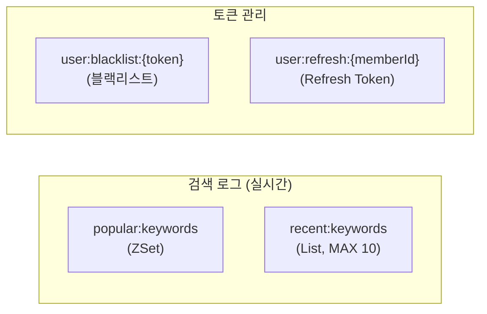

# 📚 Book MSA Platform

> **도서 관리 + Elasticsearch 검색 엔진을 갖춘 마이크로서비스 아키텍처**
>
> Spring Boot 3 기반 MSA · Kafka 이벤트 동기화 · Elasticsearch 한국어 검색 · Redis 실시간 키워드 · Spring Cloud Gateway JWT 인증

<br/>

<p align="center">
  
  
  
  
  
  
  
  
</p>

<br/>

## 📌 프로젝트 소개

Book MSA는 도서 등록·관리, Elasticsearch 기반 한국어 전문 검색, 검색 통계, 회원 인증을 독립된 마이크로서비스로 분리한 프로젝트입니다.

단순한 CRUD를 넘어 **이벤트 기반 데이터 동기화**, **Nori 형태소 분석 검색 엔진**, **Gateway 레벨 JWT 인증**, **Redis 이중 저장(실시간 + 영구)** 전략을 적용하여 실무 수준의 MSA 설계 역량을 보여주는 것을 목표로 하였습니다.

**핵심 목표**

- 🏗️ **완전한 서비스 분리** — 도서(8080), 검색(8081), 인증(8082), AI(8083), Gateway(9000) 독립 배포
- 🔍 **Elasticsearch + Nori 한국어 검색** — 형태소 분석, 자동완성, 퍼지 매칭, 카테고리 필터
- ⚡ **Kafka 기반 실시간 동기화** — MySQL 변경 → Kafka → Elasticsearch 자동 반영
- 🔐 **Gateway 레벨 JWT 인증** — Cookie 기반 토큰 추출, Redis 블랙리스트, 헤더 전파
- 📊 **Redis + ES 이중 검색 로그** — 실시간 인기 검색어(Redis ZSet) + 기간별 통계(ES Aggregation)

<br/>

---

## 🏛️ 시스템 아키텍처



<br/>

---

## 📦 서비스 구조



```
book-msa/
├── gateway/                          # API Gateway (port 9000)
│   └── src/main/java/com/a/gateway/
│       ├── config/                   # RedisConfig
│       ├── filter/                   # AuthFilter (GlobalFilter)
│       └── jwt/                      # JwtTokenValidator
│
├── book/                             # 도서 서비스 (port 8080)
│   └── src/main/
│       ├── java/com/book/
│       │   ├── controller/           # BookApiController, CategoryController, StatController
│       │   ├── domain/               # Book Entity, Category Enum
│       │   ├── dto/                  # Request/Response DTOs
│       │   ├── client/               # BookSearchClient (→ book-es 호출)
│       │   ├── kafka/                # BookEventProducer
│       │   ├── service/              # BookService
│       │   └── exception/            # BusinessException, ErrorCode
│       └── resources/
│           ├── templates/            # Thymeleaf (index, fragments)
│           └── static/               # JS, CSS
│
├── book-es/                          # 검색 서비스 (port 8081)
│   └── src/main/java/com/bookes/
│       ├── controller/               # SearchController, LogController, StatController
│       │                               IndexController, SyncController
│       ├── service/                  # SearchService, LogService, StatService
│       │                               IndexService, SyncService
│       ├── kafka/                    # BookEventConsumer
│       └── config/                   # ElasticsearchConfig, RedisConfig
│
├── user/                             # 인증/회원 서비스 (port 8082)
│   └── src/main/java/com/a/user/
│       ├── controller/               # AuthController, MemberController, PageController
│       ├── domain/                   # Member, RefreshToken, Role, BaseEntity
│       ├── security/                 # JWT, Filter, Handler, Redis 토큰
│       │   ├── config/               # SecurityConfig
│       │   ├── filter/               # CustomAuthenticationFilter, JwtAuthenticationFilter
│       │   ├── handler/              # Success/Failure/Logout Handler
│       │   ├── jwt/                  # JwtTokenProvider, JwtCookieResolver
│       │   └── redis/                # RedisTokenRepository
│       └── service/                  # AuthService, MemberService
│
└── docker-compose.yml                # ES, Kibana, Redis, Kafka, Zookeeper
```

<br/>

---

## ⚡ 주요 기능

### 도서 관리 (book-search)

| 기능 | 설명 |
|------|------|
| 도서 CRUD | JPA 기반 등록·조회·수정·삭제, 페이징 + 정렬 |
| 카테고리 분류 | 2단계 계층 구조 (국내도서 > IT/컴퓨터, 서양도서 > 소설 등) |
| Kafka 이벤트 발행 | 등록/수정/삭제 시 `book-created`, `book-updated`, `book-deleted` 토픽 발행 |
| ES 검색 프록시 | BookSearchClient로 book-es 서비스에 검색 요청 위임 |
| 검색어 자동완성 | 도서명·저자·출판사 기반 Edge N-gram 자동완성 |
| 검색 통계 | 일별/월별 트렌드, 인기 검색어, 카테고리별 도서 수 (Google Charts 시각화) |

### Elasticsearch 검색 엔진 (book-es)

| 기능 | 설명 |
|------|------|
| Nori 한국어 검색 | `nori_tokenizer` + 품사 필터링, 조사 포함 검색(with_josa) |
| 다중 필드 검색 | `multi_match` — 도서명(가중치 2배), 저자, 출판사 동시 검색 |
| 정확도 부스팅 | keyword 완전일치(100배) > 구문일치(30배) > 조사포함(20배) > 일반매칭 |
| 자동완성 | Edge N-gram Tokenizer 기반 타이핑 즉시 추천 |
| 퍼지 매칭 | `fuzziness: 1` — 오타 1글자까지 허용 |
| 카테고리 필터 | `term` 쿼리 기반 카테고리 필터링 |
| 가격 범위 필터 | `range` 쿼리 기반 최소/최대 가격 필터링 |
| Kafka 이벤트 소비 | 도서 CUD 이벤트 수신 → ES 인덱스 자동 반영 |
| MySQL ↔ ES 동기화 | Bulk Upsert + Delete — 전체 데이터 정합성 보장 |
| 인덱스 관리 | 생성/삭제/존재확인/정보조회 API |

### 검색 로그 & 통계

| 기능 | 설명 |
|------|------|
| 이중 저장 | Redis(실시간 조회) + Elasticsearch(기간별 통계) |
| 인기 검색어 | Redis Sorted Set — 검색할 때마다 score 증가, TOP 10 반환 |
| 최근 검색어 | Redis List — LPUSH + LTRIM으로 최근 10개 유지 |
| 서버 재시작 복원 | `@PostConstruct`로 ES → Redis 자동 복원 |
| 일별 트렌드 | ES `date_histogram` Aggregation (최근 30일) |
| 월별 트렌드 | ES `date_histogram` Aggregation (최근 12개월) |
| 인기 검색어 통계 | ES `terms` Aggregation (TOP 10) |
| 카테고리별 도서 수 | ES `terms` Aggregation |

### 인증 & 회원 (user)

| 기능 | 설명 |
|------|------|
| JWT 인증 | Access Token(30분) + Refresh Token(7일) 이중 토큰 |
| 토큰 이중 저장 | Redis(빠른 조회 + 블랙리스트) + MySQL(영속성) |
| Stateless 세션 | `SessionCreationPolicy.STATELESS` — 세션 미사용 |
| HttpOnly 쿠키 | `SameSite=Strict`, `HttpOnly=true` — XSS 방어 |
| 커스텀 필터 체인 | CustomAuthenticationFilter(로그인) + JwtAuthenticationFilter(인증) |
| 회원 관리 | 가입, 이메일/닉네임 중복 확인, 정보 수정, 비밀번호 변경, 탈퇴 |
| 포인트 시스템 | 적립/사용, 잔액 부족 시 예외 처리 |

### API Gateway

| 기능 | 설명 |
|------|------|
| 경로 기반 라우팅 | 5개 서비스로 요청 분배 (user, book, es, ai, 정적 리소스) |
| GlobalFilter JWT 인증 | 쿠키에서 토큰 추출 → 검증 → Redis 블랙리스트 확인 |
| 헤더 전파 | `X-User-Email`, `X-User-Id`, `X-User-Role` 하위 서비스 전달 |
| Permit All 경로 | 로그인/회원가입/정적리소스 등 인증 불필요 경로 관리 |
| WebFlux + Netty | 비동기 논블로킹 기반 고성능 게이트웨이 |

<br/>

---

## 🔄 이벤트 흐름 상세

### 도서 CRUD → ES 동기화 플로우



### 검색 + 로그 저장 플로우



### JWT 인증 플로우



<br/>

---

## 🗂️ ERD



<br/>

---

## 🔍 Elasticsearch 인덱스 설계

### books 인덱스 매핑



| 필드 | 타입 | 분석기 | 서브 필드 | 용도 |
|------|------|--------|-----------|------|
| `bookKey` | keyword | — | — | PK, 정확 매칭 |
| `isbn` | keyword | — | — | 정확 매칭 |
| `bookName` | text | nori_analyzer | `.keyword` (완전일치)<br/>`.autocomplete` (Edge N-gram)<br/>`.with_josa` (Standard) | 한국어 검색 + 자동완성 |
| `authName` | text | nori_analyzer | `.keyword`, `.autocomplete` | 저자 검색 + 자동완성 |
| `pubName` | text | nori_analyzer | `.keyword`, `.autocomplete` | 출판사 검색 + 자동완성 |
| `pubDate` | date | — | — | 날짜 필터 |
| `bookPrice` | integer | — | — | 가격 범위 필터 |
| `category` | keyword | — | — | 카테고리 필터 |

### search_log 인덱스

| 필드 | 타입 | 용도 |
|------|------|------|
| `keyword` | keyword | 검색어 집계 (terms agg) |
| `searchDate` | date | 기간별 트렌드 (date_histogram agg) |
| `resultCount` | integer | 검색 결과 수 |

<br/>

---

## 🔧 Redis 활용 전략



| 용도 | 키 패턴 | 자료구조 | 설명 |
|------|---------|---------|------|
| 인기 검색어 | `popular:keywords` | Sorted Set | ZINCRBY로 검색 횟수 누적, reverseRange TOP 10 |
| 최근 검색어 | `recent:keywords` | List | LPUSH + LTRIM 최근 10개 유지 |
| 토큰 블랙리스트 | `user:blacklist:{token}` | String | 로그아웃 시 등록, Gateway에서 체크 |
| Refresh Token | `user:refresh:{memberId}` | String | 토큰 재발급 시 조회 |

<br/>

---

## 🛠️ 기술 스택

### Backend

| 구분 | 기술 |
|------|------|
| Language | Java 21 |
| Framework | Spring Boot 3.5, Spring Security, Spring Cloud Gateway (WebFlux) |
| ORM | Spring Data JPA |
| Search | Elasticsearch 8.17 (Java Client), Nori Tokenizer |
| Messaging | Apache Kafka (3 Topics: book-created/updated/deleted) |
| Cache | Redis (Sorted Set, List, String) |
| Database | MySQL 8.0 (book_db, user_db) |
| Auth | JWT (JJWT 0.12.3) — Cookie 기반, HttpOnly + SameSite |
| HTTP Client | RestClient (book → book-es), WebClient (book-es → book) |
| Build | Gradle (Groovy DSL), 개별 모듈 |
| Infra | Docker Compose (ES + Kibana + Redis + Kafka + Zookeeper) |

### Frontend

| 구분 | 기술 |
|------|------|
| Template | Thymeleaf (서버 사이드 라우팅) |
| Layout | Thymeleaf Layout Dialect |
| Script | Vanilla JavaScript |
| Chart | Google Charts (검색 통계 시각화) |
| Style | Custom CSS |

<br/>

---

## 📊 API 엔드포인트

### Gateway 라우팅 테이블

| Route ID | URI | Path 패턴 |
|----------|-----|-----------|
| user-auth | `http://localhost:8082` | `/api/auth/**` |
| user-members | `http://localhost:8082` | `/api/members/**` |
| user-page | `http://localhost:8082` | `/`, `/main`, `/login`, `/signup`, `/my-page`, 정적 리소스 |
| book-service | `http://localhost:8080` | `/api/books/**` |
| es-service | `http://localhost:8081` | `/api/search/**` |
| ai-service | `http://localhost:8083` | `/api/ai/**` |

### 인증 (user - port 8082)

| Method | Endpoint | 설명 |
|--------|----------|------|
| `POST` | `/api/auth/signup` | 회원가입 |
| `POST` | `/api/auth/login` | 로그인 (JWT 쿠키 발급) |
| `POST` | `/api/auth/logout` | 로그아웃 (블랙리스트 등록) |
| `POST` | `/api/auth/reissue` | 토큰 재발급 |
| `GET` | `/api/auth/check-email` | 이메일 중복 확인 |
| `GET` | `/api/auth/check-nickname` | 닉네임 중복 확인 |

### 회원 (user - port 8082)

| Method | Endpoint | 설명 |
|--------|----------|------|
| `GET` | `/api/members/me` | 내 정보 조회 |
| `PUT` | `/api/members/me` | 회원 정보 수정 |
| `PUT` | `/api/members/password` | 비밀번호 변경 |
| `DELETE` | `/api/members/me` | 회원 탈퇴 (Soft Delete) |
| `GET` | `/api/members/point` | 포인트 조회 |

### 도서 (book - port 8080)

| Method | Endpoint | 설명 |
|--------|----------|------|
| `GET` | `/api/books` | 전체 조회 (페이징 + 정렬) |
| `GET` | `/api/books/{id}` | 단건 조회 |
| `POST` | `/api/books` | 도서 등록 → Kafka 발행 |
| `PUT` | `/api/books/{id}` | 도서 수정 → Kafka 발행 |
| `DELETE` | `/api/books/{id}` | 도서 삭제 → Kafka 발행 |
| `GET` | `/api/books/search/filter` | ES 검색 (복합 필터) + 로그 저장 |
| `GET` | `/api/books/search/autocomplete` | 자동완성 |
| `GET` | `/api/books/search/recent` | 최근 검색어 (Redis) |
| `GET` | `/api/books/search/popular` | 인기 검색어 (Redis) |
| `DELETE` | `/api/books/search/recent/all` | 최근 검색어 전체 삭제 |

### 검색 엔진 (book-es - port 8081)

| Method | Endpoint | 설명 |
|--------|----------|------|
| `GET` | `/api/books/search/filter` | Elasticsearch Bool 쿼리 검색 |
| `GET` | `/api/books/autocomplete` | Edge N-gram 자동완성 |
| `POST` | `/api/log/search` | 검색 로그 저장 (Redis + ES) |
| `GET` | `/api/log/recent` | 최근 검색어 TOP 10 |
| `GET` | `/api/log/popular` | 인기 검색어 TOP 10 |
| `DELETE` | `/api/log/recent/all` | 최근 검색어 전체 삭제 |
| `GET` | `/api/stats/search-trend` | 일별 검색 트렌드 (30일) |
| `GET` | `/api/stats/monthly-trend` | 월별 검색 트렌드 (12개월) |
| `GET` | `/api/stats/popular-keywords` | 인기 검색어 통계 TOP 10 |
| `GET` | `/api/stats/category-count` | 카테고리별 도서 수 |
| `POST` | `/api/index/create` | books 인덱스 생성 (Nori 매핑) |
| `POST` | `/api/index/create/search-log` | search_log 인덱스 생성 |
| `POST` | `/api/sync` | MySQL → ES 전체 동기화 |

<br/>

---

## 🏗️ 설계 포인트

### 1. 서비스 간 통신 패턴

```java
// book → book-es: 동기 호출 (RestClient)
// 검색 결과가 즉시 필요한 경우
private final RestClient bookEsRestClient;

public PageResponse<BookSearchResponse> searchWithFilter(BookSearchRequest request, int page, int size) {
    return bookEsRestClient.get()
            .uri(uriBuilder -> uriBuilder.path("/api/books/search/filter")...)
            .retrieve()
            .body(new ParameterizedTypeReference<>() {});
}

// book → book-es: 비동기 통신 (Kafka)
// 데이터 변경 이벤트, 즉시 응답 불필요
kafkaTemplate.send("book-created", bookKey, message);
```

동기(RestClient)와 비동기(Kafka) 통신을 용도에 따라 분리했습니다. 검색 요청처럼 즉시 결과가 필요한 경우 RestClient, 데이터 동기화처럼 최종 일관성으로 충분한 경우 Kafka를 사용합니다.

### 2. Gateway 레벨 인증 — 하위 서비스 인증 부담 제거

```java
// Gateway AuthFilter: 인증 통과 시 헤더에 사용자 정보 주입
ServerHttpRequest mutatedRequest = request.mutate()
        .header("X-User-Email", jwtTokenValidator.getEmail(token))
        .header("X-User-Id",    String.valueOf(jwtTokenValidator.getUserId(token)))
        .header("X-User-Role",  jwtTokenValidator.getRole(token))
        .build();
```

모든 인증 로직을 Gateway에서 처리하고, 하위 서비스는 `X-User-*` 헤더만 읽으면 됩니다. 각 서비스에서 JWT 라이브러리를 중복으로 사용할 필요가 없습니다.

### 3. Nori 검색 정확도 부스팅 전략

```java
// 4단계 스코어링: 완전일치 > 구문일치 > 조사포함 > 일반 형태소
b.must(m -> m.bool(bool -> bool
    .must(must -> must.multiMatch(mm -> mm
        .fields("bookName^2", "bookName.with_josa", "authName", "pubName")
        .query(keyword).fuzziness("1").operator(And)))
    .should(should -> should.match(mt -> mt
        .field("bookName.keyword").query(keyword).boost(100.0f)))   // 완전일치
    .should(should -> should.matchPhrase(mp -> mp
        .field("bookName").query(keyword).boost(30.0f)))            // 구문일치
    .should(should -> should.matchPhrase(mp -> mp
        .field("bookName.with_josa").query(keyword).boost(20.0f)))  // 조사포함
));
```

"자바 프로그래밍" 검색 시 정확히 같은 제목의 책이 최상위에, 형태소만 일치하는 책은 하위에 노출됩니다.

### 4. ES ↔ Redis 이중 검색 로그 + 서버 재시작 복원

```
저장:   Redis (실시간 ZSet/List) + ES (영구 document)
조회:   Redis에서 바로 반환 (빠름)
통계:   ES Aggregation (기간별 분석)
복원:   @PostConstruct → ES에서 Redis 재구성
삭제:   Redis + ES 동시 삭제
```

Redis가 휘발성이므로 ES에 영구 보관하고, 서버 재시작 시 ES 데이터로 Redis를 자동 복원합니다.

### 5. MySQL ↔ ES Bulk 동기화

```java
// Upsert: MySQL 전체 데이터 → ES에 추가/업데이트
// Delete: MySQL에는 없는데 ES에만 있는 문서 → 삭제
Set<String> deleteKeys = new HashSet<>(esBookKeys);
deleteKeys.removeAll(mysqlBookKeys);  // 차집합 = 삭제 대상
```

Kafka 실시간 동기화 외에, 수동 Bulk 동기화 API를 제공하여 데이터 정합성을 보장합니다.

<br/>

---

## 🚀 실행 방법

### 1. 인프라 실행

```bash
cd book-es
docker-compose up -d
```

> Elasticsearch(9220), Kibana(5620), Redis(6339), Kafka(9095), Zookeeper(2188) 실행

### 2. ES 인덱스 생성

```bash
# books 인덱스 생성 (Nori 매핑 포함)
curl -X POST http://localhost:8081/api/index/create

# search_log 인덱스 생성
curl -X POST http://localhost:8081/api/index/create/search-log
```

### 3. 서비스 실행 (순서)

```bash
# 1. 인증 서비스
cd user && ./gradlew bootRun        # port 8082

# 2. 도서 서비스
cd book && ./gradlew bootRun        # port 8080

# 3. 검색 서비스
cd book-es && ./gradlew bootRun     # port 8081

# 4. API Gateway
cd gateway && ./gradlew bootRun     # port 9000
```

### 4. 데이터 동기화

```bash
# MySQL 기존 데이터 → ES 동기화
curl -X POST http://localhost:8081/api/sync
```

<br/>

---

<p align="center">
  <sub>Built with Java 21 · Spring Boot 3.5 · Spring Cloud Gateway · Elasticsearch 8.17 · Kafka · Redis · MySQL</sub>
</p>
